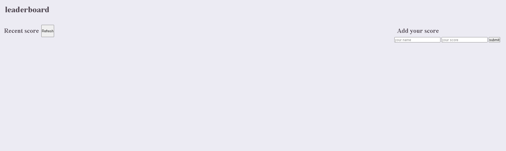

# mario leaderboard

- This is an interactive site for a mario game to show the high score

## screenshot

### desktop

## Getting Started

- this is a

### author

**Yahya EL Ganayni**

- GitHub: [@githubhandle](https://github.com/yahyaelganyni1)
- Twitter: [@twitterhandle](https://twitter.com/@crazy20046)
- LinkedIn: [LinkedIn](https://www.linkedin.com/in/yahya-el-ganayni-a456115b/)

## Built With

- JavaScript
- Webpack
- HTML & CSS

## Acknowledgments

- Hat tip to anyone whose code was used
- Inspiration
- etc

## 📝 License

This project is [MIT](lic.url) licensed.
